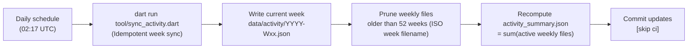

# Contributor data pipeline

This document details the automated pipeline tracking rolling 12-month contribution activity across the Flutter project.

## Monitored repositories

The pipeline collects activity across all public repositories in the `flutter` GitHub organization (`org:flutter is:public`).

## Metrics collected

The pipeline records 3 qualifying contribution types:
1. Merged pull requests, attributed to the PR author.
2. Code reviews on merged pull requests, attributed to non-author reviewers.
3. Issues opened across tracked repositories, attributed to the author.

### Exclusions and filtering

- Accounts in the `@flutter/robots` GitHub team and known automation usernames defined in `tool/bots.dart` are excluded.
- Members of `@flutter/googlers` and `@flutter/partners` are excluded to conserve GitHub API rate limits.

## Dataset structure

Data is stored as a 52-week sliding ring buffer in `data/`:

```
data/
├── activity/
│   ├── 2025-W31.json
│   ├── 2025-W32.json
│   ├── ...
│   ├── 2026-W29.json
│   └── 2026-W30.json
└── activity_summary.json
```

- `data/activity/` holds 52 discrete weekly JSON snapshots (`YYYY-Wxx.json`). Each file records the contributions for that ISO week.
- `data/activity_summary.json` holds the rolling 12-month totals per contributor, calculated directly as the sum of all active weekly files.

## Daily execution and rolling purge



- Each night at 02:17 UTC, the GitHub Actions workflow (`.github/workflows/sync_activity.yml`) queries the current ISO week of activity using GraphQL with cursor pagination.
- The week's snapshot in `data/activity/` is updated idempotently, avoiding double-counting across runs. Reviews are deduplicated per merged pull request.
- Snapshot files older than 52 weeks are pruned based on their ISO week filenames.
- `data/activity_summary.json` is recalculated by summing the active weekly files with deterministically sorted keys, rolling off activity older than 12 months without requiring historical re-scans.
